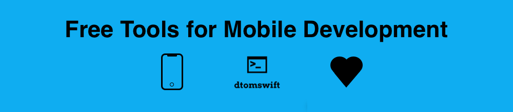

Below is a list I've been curating of free tools I use when making mobile apps. It's been really useful to me and I thought I'd share what I've found with the community.  My main goal here is to have free resources that can help you if you're stuck, if you need to reference something or just to give you ideas in general. These resources are either completely free or have a free tier you can sign up to. Wherever possible I try to use mainly online tools as opposed to software you download in order to save hard disk space. However, some of these tools can be downloaded on the app store. 

 

### API (Free/fake for testing 
- [jsonplaceholder typicode](https://jsonplaceholder.typicode.com): free online REST API that you can use whenever you need some fake data.

### APP ICON GENERATOR 
- [makeAppIcon](https://makeappicon.com): App icon generator
- [appicon.co](https://appicon.co): App icon generator
- [easyappicon](https://easyappicon.com):  App icon generator
- [photopea](https://photopea.com): Create your own app icon

### BOOKMARKING
- [raindrop](https://raindrop.io/download): Bookmark stuff for later

### CHARTS/DIAGRAMS
- [app.diagrams](https://app.diagrams.net): Create charts / diagrams / maps / tables

### CHEATSHEETS 
- [fontAwesome](https://fontawesome.com/cheatsheet): Cheatshet for fontawesome icons

### CLOSURE SYNTAX (iOS)
- [closure syntax](https://fuckingclosuresyntax.com): Quickly reference closure syntax here.
- [block syntax](http://fuckingblocksyntax.com): Same as the above link, but for blocks in objc.
- [multiple trailing closure syntax](https://fuckingmultipletrailingclosuresyntax.com): Quickly reference multiple trailing closure syntax ios

### CODE SNIPPETS
- [code grepper](https://www.codegrepper.com/search.php): Great little websites for getting code snippets quickly and efficiently 
- [one liner hub](https://onelinerhub.com): Same as above

### COLLABORATION 
- [whimsical](https://whimsical.com): Create flowcharts, wireframes, sticky notes and mind maps. Invite teammates to collaborate with you
- [notion](https://www.notion.so): Collaborate with your team online with an online whiteboard

### COLOR SCHEMES AND PALETTES
- [Coolors.co](https://coolors.co): Color scheme generator
- [palettron](https://paletton.com/#uid=12U0u0kllllaFw0g0qFqFg0w0aF): Color Scheme Generator 
- [Color Review](https://color.review) :  Undertsand color contrast better
- [Color Box](https://colorbox.io): Create precise color palettes 

### DATABASE DIAGRAMMING TOOLS
- [drawsql](https://drawsql.app): Create, visualize and collaborate on your database entity relationship diagrams (Free Tier version available)
- [dbdiagram](https://dbdiagram.io/home): A simple tool to draw ER diagrams by just writing code (Free Tier version available)
- [erd plus](https://erdplus.com): A browser-based database modeling tool for creating Entity Relationship Diagrams, Relational Schemas, Star Schemas, and SQL DDL statements.

### DATE FORMATTER (iOS)
- [NSDateFormatter](https://nsdateformatter.com): Quickly reference NSDATEs

### DISCLAIMER GENERATOR 
- [disclaimer generator](https://www.disclaimergenerator.net): Generate disclaimers online for free
- [terms feed](https://www.termsfeed.com/disclaimer-generator/): Online disclaimer generator

### EMOJIS 
- [emojipedia](https://emojipedia.org): Emojis for anything

### ESTIMATE TIME/MONEY FOR PROJECT
- [EstimateMyApp](https://estimatemyapp.com): Estimate how long a project will take, as well as its cost

### EVENTS
- [forekast](https://forekast.com ): Upcoming fun events!
- [UxAgenda](https://uxagenda.com): A comprehensive database of design conferences, workshops and meetups

### FONTS and TYPOGRAPHY
- [fontflipper](https://www.fontflipper.com): Identify a font you like from an image
- [modularscale](https://www.modularscale.com/?1&em&1.5): What scale should your font have? 
- [type-scale](https://type-scale.com): Help scale your font

### GIT STUFF 
- [gitignore.io](https://www.toptal.com/developers/gitignore): Enter the IDE of your choice or other options and it will automatically generate a gitignore file consisting of useful ignores

### GOLDEN RATIO CALCULATOR
- [golden ratio](https://miniwebtool.com/golden-section-calculator/): Create the golden ratio 

### GRADIENTS
- [uigradients](https://uigradients.com/#Mirage): Create uigradients easily

### ICONS
- [iconmonstr](https://iconmonstr.com): Icon monster
- [flaticon](https://www.flaticon.com): Flat icons
- [basic icons](https://basicons.xyz): Basic icons 
- [fontawesome](https://fontawesome.com/cheatsheet): fontawesome icons
- [remix icon](https://remixicon.com): Free icon library

### IF CASE LET SYNTAX (iOS)
- [If Case Let Syntax](https://fuckingifcaseletsyntax.com): Quickly reference if case let syntax in swift

### IMAGE/PHOTO EDITING
- [compressor](https://compressor.io): Free online image compressor. Choose between lossy or lossless compression to get the best balance between image quality and file size.
- [tinypng](https://tinypng.com): Optimize your pngs
- [tinyjpg](https://tinyjpg.com ): Optimize your jpgs
- [pilexr](https://pixlr.com): Create posters, flyers and collages from templates. Remove background from images. Access stock photography.
- [vectary](https://www.vectary.com): Browser-based 3D content creation tool. View your design in Augmented Reality. Supports team collaboration.
- [place img](https://placeimg.com/1000/800/tech): Free image generator service. Go to placeimg.com and add on /width/height/category at the end.

### GIT VERSION CONTROL RESOURCES
- [osgit](https://ohshitgit.com): Some quick tips for when you make mistakes using GIT

### JSON FORMATTERS
- [app quicktype](https://app.quicktype.io): Don't waste time creating model structs for your json. Just copy and paste everything here. 
- [json grid](https://jsongrid.com/json-viewer): Use this tool to see your JSON in GRIDS/TABLES!
- [json parser online](http://json.parser.online.fr): Online JSON parser/formatter
- [csv2json](https://csvjson.com/csv2json): CSV to JSON Converter

### LANDING PAGE FOR APP
- [appsite](https://appsite.skygear.io): Create a landing page for your mobile app

### LOREM IPSUM GENERATORS 
- [lorem ipsum](https://loremipsum.io): Generate general placeholder text for your app
- [lipsum](https://www.lipsum.com):  Generate general placeholder text for your app
- [bacon ipsum](https://baconipsum.com):  Generate bacon themed placeholder text for your app
- [tuna ipsum](https://tunaipsum.com): Generate tuna themed placeholder text for your app
- [cupcake ipsum](http://www.cupcakeipsum.com):  Generate cupcake themed placeholder text for your app
- [slipsum](https://slipsum.com):  Generate Samuel Jackson themed placeholder text for your app
- [obama ipsum](https://obamaipsum.com): Generate Barack Obama themed placeholder text for your app
- [nietzsche ipsum](http://nietzsche-ipsum.com): Generate Nietzsche themed placeholder text for your app
- [office ipsum](http://officeipsum.com): Generate office themed placeholder text for your app
- [deGrasse ipsum](http://neilipsum.pw/#/): Generate Neil DeGrasse Tyson themed placeholder text for your app
- [sagan ipsum](http://saganipsum.com): Generate Carl Sagan themed placeholder text for your app
- [rick and morty ipsum](http://loremricksum.com): Generate Rick and Morty themed placeholder text for your app

### MARKDOWN 
- [dillinger](www.dillinger.io): Create markdown easily 
- [markdownify](https://markdownify.js.org): Download markdown software 
- [tables generator](https://www.tablesgenerator.com/markdown_tables): Easily create and modify tables in your markdown
- [readme.so](https://readme.so/editor): Really easy to use GUI editor for quickly creating markdown
- [stack edit](https://stackedit.io/app#): Really cool markdown editor. You can even create UML diagrams, create files and folder to be synchronized to online drives, show mathematical formulas and create flowcharts. 

### MAP/FILTER/REDUCE
- [useYourLoaf article](https://useyourloaf.com/blog/swift-guide-to-map-filter-reduce/): Great explanation for map, filter, reduce functions in swift.

### MOBILE APP DESIGN WEBSITES 
- [dribbble](https://www.dribbble.com): Check out designers' portfolios to get more ideas
- [mobbin](https://www.mobbin.com): Check out designers' portfolios to get more ideas
- [mthds](https://mthds.co): Check out designers' portfolios to get more ideas
- [behance](https://behance.net): Check out designers' portfolios to get more ideas

### MOCKUPS 
- [Adobe XD](https://www.adobe.com/ie/products/xd.html): FREE powerful mockup tool for mobile and web development
- [pencil](https://pencil.evolus.vn): Open-source GUI prototyping tool that's available for ALL platforms
- [ls.graphics](https://www.ls.graphics/free-mockups): Free assets for mockups are occasionally offered here
- [balsamiq](https://balsamiq.com/): Download this free desktop app for creating mobile and web mockups + wireframes

### NAME GENERATORS 
- [namelix](https://namelix.com): Generate names for your mobile apps 
- [business name generator](https://businessnamegenerator.com): Generate names for your mobile apps 
- [panabee](https://www.panabee.com/app-name-generator): Generate names for your mobile apps 

### NSDATEFORMATTER 
- [nsdateformatter](https://nsdateformatter.com): Easy Skeezy Date Formatting for Swift and Objective-C

### OBJECTIVE-C RESOURCES 
- [swiftify](https://swiftify.com/converter/code/): Convert your objc code to swift with a quick copy and paste
- [Apple Developer ObjC docs](https://developer.apple.com/library/archive/documentation/Cocoa/Conceptual/ProgrammingWithObjectiveC/Introduction/Introduction.html#//apple_ref/doc/uid/TP40011210): Offical Apple Developer Objc Documentation for reference purposes
- [goshdarnblocksyntax](http://goshdarnblocksyntax.com): Objc block syntax

### ONLINE TRENDS 
- [also asked](https://alsoasked.com): Company offering free online trend search
- [exploding topics](https://explodingtopics.com): Company offering free online trend search
- [answer the public](https://answerthepublic.com): Company offering free online trend search

### PACKAGES:
- [Swift Package Index](https://swiftpackageindex.com): Swift Package Index 

### PHOTO EDITOR (ONLINE)
- [fotor](https://www.fotor.com/photo-editor-app/editor/basic): Photo editor 

### PRIVACY POLICY GENERATOR 
- [App Privacy Policy Generator by nisrulz](https://app-privacy-policy-generator.nisrulz.com): Generate privacy policy free of charge for deploying app on app store
- [free privacy policy](https://www.freeprivacypolicy.com): Generate privacy policies/ T&Cs/ Cookies policies/ Return and Refund policies/ Disclaimers

### PROFILE PIC MAKER 
- [pfpmaker](https://pfpmaker.com): Upload photo to remove background for a profile pic

### PROJECT MANAGEMENT 
- [MindNode](https://apps.apple.com/ie/app/mindnode-mind-map-outline/id1289197285?mt=12): Organize your ideas in a mind map (App store download)
- [Trello](https://trello.com): Kanban board tool for project management.

### REGEX
- [debuggex](https://www.debuggex.com): Useful regex resource

### SCHEDULING
- [cally](https://cally.com): Schedule meetings for free

### SCREENSHOTS
- [mockuphone](https://mockuphone.com ): Create screenshots for app store 
- [shareX](https://getsharex.com): Screen capture, sharing and productivity tool 

### SEMANTIC VERSIONING 
- [sem ver](https://semver.org/): This resource explains how to version your app with the MAJOR.MINOR.PATCH format.

### SIMULATOR
- [Simulator Status Magic](https://github.com/shinydevelopment/SimulatorStatusMagic?utm_campaign=iOS%2BDev%2BWeekly&utm_medium=email&utm_source=iOS%2BDev%2BWeekly%2BIssue%2B533): Modify the iOS Simulator so that it has a perfect status bar, then run your app and take perfect screenshots every time. The modifications made are designed to match the images you see on the Apple site

### SOUND EFFECTS
- [mixkit](https://mixkit.co): Download free sound FX 

### SVG GENERATOR 
- [pattern monster](https://pattern.monster): Create SVG patterns for your app

### SWIFT LANGUAGE RESOURCES
- [Official Docs](https://swift.org): Swift Language Reference Guide
- [get awesomeness](https://getawesomeness.herokuapp.com/get/swift): Random awesome Swift resources

### SYMBOLS
- [cool symbol](https://coolsymbol.com): Copy and paste cool symbols into your projects.

### TIME TRACKING 
- [clockify](https://clockify.me): 

### USER STORIES 
- [write a user story](http://www.writeauserstory.com): Generate User stories easily

### UUID GENERATOR
-[uuid generator](https://www.uuidgenerator.net): Online tool that generates up to 500 uuids with just one click.

### WIREFRAMES 
- [wireframer](https://wireframer.art): Create wireframes easily 

### WHITEBOARD 
- [aww app](https://awwapp.com/b/u0m8tjdymobz1/#): Use whiteboard online to jot down ideas

### MORE WEBSITES WITH LISTS OF TOOLS: 
- [free for dev](https://free-for.dev/#/)
- [pine tools](https://pinetools.com)
- [foss hub](https://www.fosshub.com/categories.html)
